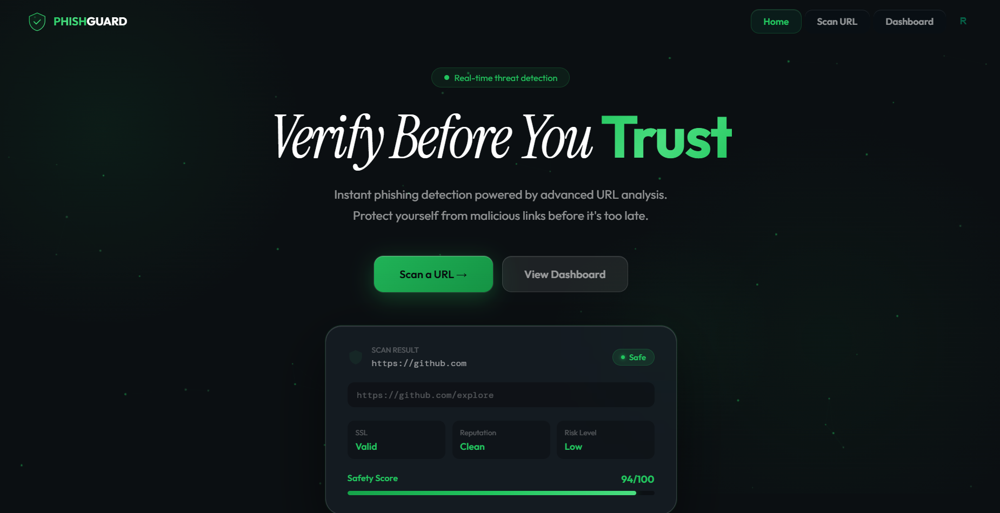

<div align="center">
  
</div>

<br/>

<div align="center">

  <a href="https://phishguard.qzz.io"></a>
  &nbsp;
  
  &nbsp;
  
  &nbsp;
  

  <br/><br/>

  
  
  
  
  
  
  
  

</div>

<br/>

<div align="center">
  <sup>🔒 This is a <strong>public showcase only</strong> — source code, Firebase config, detection logic, and backend implementation are maintained in a private repository.</sup>
</div>

---

## &nbsp;What is PhishGuard?

PhishGuard is a cybersecurity web application that tells you whether a URL is safe to visit — before you click it. Paste any link and get an instant, human-readable security report: a safety score, a risk classification, and a clear breakdown of exactly what looks suspicious.

No installation. No technical knowledge required.

&nbsp;🌐 &nbsp;[**Try it live at phishguard.qzz.io**](https://phishguard.qzz.io)

---

## &nbsp;Detection Engine

Every URL is analyzed through **4 independent layers** — no single point of failure.

<br/>

<div align="center">

| &nbsp; | Layer | Method | What it catches |
|:------:|:------|:-------|:----------------|
| `01` | **Blocklist** | Dataset lookup | Known phishing domains — instant, zero latency |
| `02` | **ML Model** | scikit-learn classifier | Novel phishing patterns via 21 lexical URL features |
| `03` | **Heuristics** | Rule engine | Suspicious TLDs · brand impersonation · lookalike domains · IP hosts · phishing keywords |
| `04` | **VirusTotal** | API cross-check | Validated against 70+ live security engines |

</div>

<br/>

The final score (`0 – 100`) maps to four classifications:

<div align="center">

| Score | Classification | Risk |
|:-----:|:--------------|:-----|
| 80 – 100 | 🟢 &nbsp;**Safe** | Low |
| 58 – 79 &nbsp; | 🟡 &nbsp;**Suspicious** | Medium |
| 32 – 57 &nbsp; | 🟠 &nbsp;**Phishing** | High |
| 0 – 31 &nbsp;&nbsp; | 🔴 &nbsp;**Malicious** | Critical |

</div>

---

## &nbsp;Features

<br/>

<table>
<tr>
<td width="50%" valign="top">

### 🔍 &nbsp;URL Scanner
- Real-time threat detection for any URL
- Safety score with color-coded risk level
- Per-flag threat breakdown — tells you *why*
- No account required

<br/>

### 📊 &nbsp;Dashboard
- 7-day scan activity chart
- Threat distribution pie chart
- Animated live metric cards
- Searchable & filterable history table
- One-click CSV export

</td>
<td width="50%" valign="top">

### 🧩 &nbsp;Browser Extension
- Auto-scans every URL you visit
- Badge updates instantly — 🟢 🟡 🔴
- Desktop notifications for threats
- Liquid glass popup UI
- Chrome · Edge · Brave · Opera

<br/>

### 🔐 &nbsp;Authentication
- Google Sign-In + Email/Password
- Scan history synced to Firestore
- Works offline with localStorage fallback

</td>
</tr>
</table>

---

## &nbsp;Screenshots

<br/>

<div align="center">

**URL Scanner**


<br/><br/>

**Scan Result**


<br/><br/>

**Dashboard**


<br/><br/>

**Authentication**


<br/><br/>

**Mobile**


</div>

---

## &nbsp;Architecture

```
╔══════════════════════════════════════════════════════════════════╗
║                        User Interfaces                          ║
║                                                                  ║
║   ┌──────────────────────────┐    ┌───────────────────────────┐ ║
║   │      Web App  (SPA)      │    │    Browser Extension      │ ║
║   │   phishguard.qzz.io      │    │    Manifest V3            │ ║
║   │   HTML · CSS · JS        │    │    Chrome · Edge · Brave  │ ║
║   └─────────────┬────────────┘    └──────────────┬────────────┘ ║
╚═════════════════╪═══════════════════════════════╪══════════════╝
                  └──────────────┬────────────────┘
                                 ▼
╔══════════════════════════════════════════════════════════════════╗
║               Netlify Serverless Function  /api/scan            ║
║                                                                  ║
║   [Blocklist]──▶[ML Model]──▶[Heuristics]──▶[VirusTotal API]   ║
║                                                                  ║
║              score · status · flags · domain info               ║
╚═══════════════════════════════╤══════════════════════════════════╝
                                │
                ┌───────────────┴────────────────┐
                ▼                                ▼
   ┌────────────────────────┐      ┌─────────────────────────────┐
   │    Firebase Auth       │      │      Cloud Firestore         │
   │    Google · Email      │      │      users/{uid}/scans       │
   └────────────────────────┘      └─────────────────────────────┘
```

---

## &nbsp;Tech Stack

<br/>

<div align="center">

| Layer | Technology | Role |
|:------|:-----------|:-----|
| **Frontend** | HTML5 · CSS3 · Vanilla JS (ES6+) | SPA, animations, Canvas charts |
| **Routing** | History API | Clean URLs, back-button support |
| **Backend** | Netlify Serverless Functions | Scan API endpoint |
| **Threat Intel** | VirusTotal API | 70+ AV engine cross-validation |
| **Auth** | Firebase Authentication | Google Sign-In + Email/Password |
| **Database** | Cloud Firestore | Scan history, user data |
| **ML Training** | Python · scikit-learn · joblib | 450K-URL model, 21 features |
| **Extension** | Chrome Manifest V3 | Background monitoring, alerts |

</div>

---

## &nbsp;Roadmap

<br/>

**Shipped**

- [x] 4-layer detection engine
- [x] ML model trained on 450K URLs
- [x] Real-time URL scanner
- [x] User dashboard with interactive charts
- [x] Firebase auth & Firestore sync
- [x] CSV export
- [x] Browser extension (Manifest V3)

**Upcoming**

- [ ] Email phishing scanner
- [ ] QR code safety checker
- [ ] SSL certificate deep inspection
- [ ] WHOIS & domain age analysis
- [ ] Password leak detection
- [ ] Threat intelligence feed integration
- [ ] Mobile app

---

## &nbsp;Disclaimer

PhishGuard is developed for educational, research, and cybersecurity awareness purposes. Security reports generated by the application are informational and should not replace comprehensive professional security assessments.

---

## &nbsp;Author

Built by **Rishipratim Karmakar**. Open to discussions, collaboration, and feedback.

<br/>

---

<br/>

<div align="center">

  <a href="https://phishguard.qzz.io">
    
  </a>

  <br/><br/>

  <sub>⭐ &nbsp;If you found this project useful, consider starring the repository</sub>

  <br/><br/>

</div>
