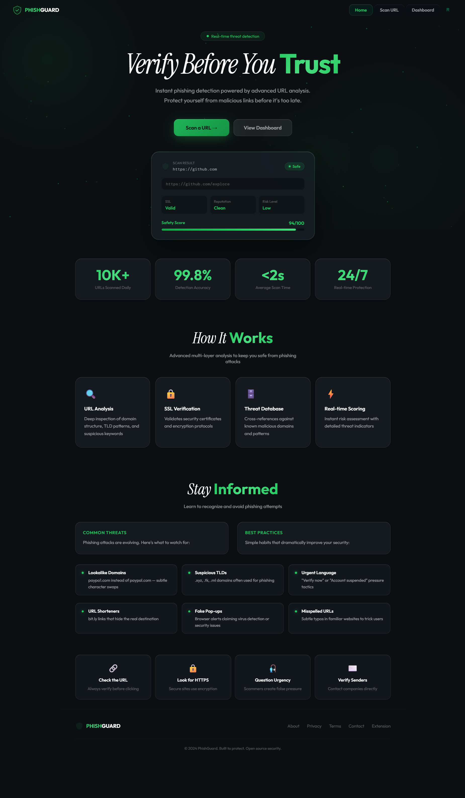
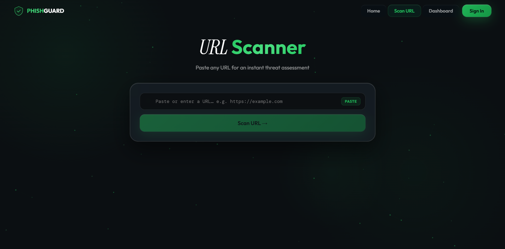
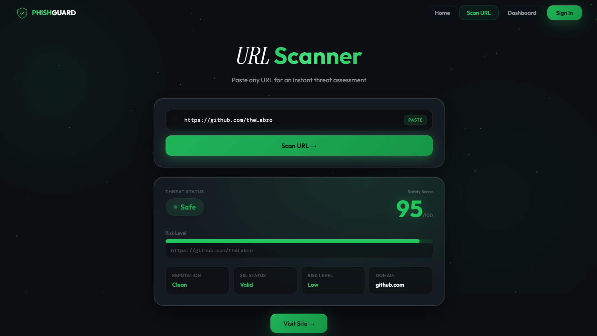
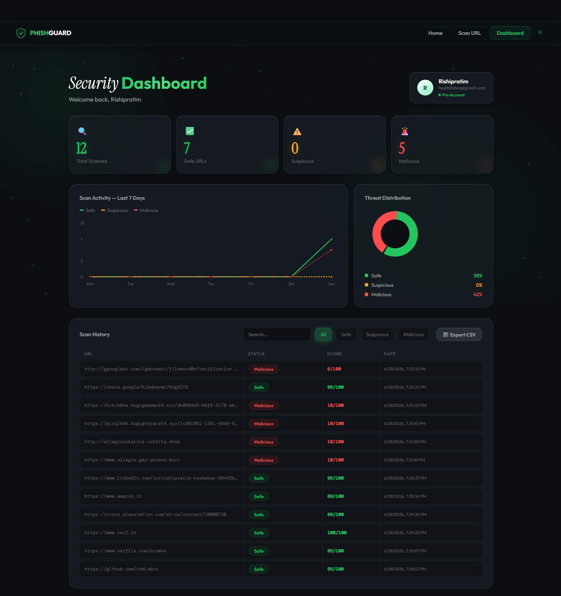
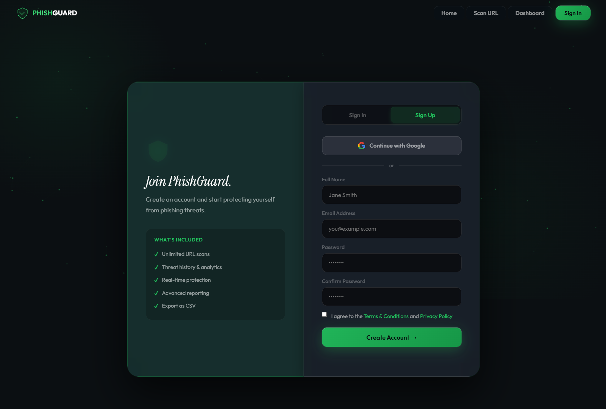
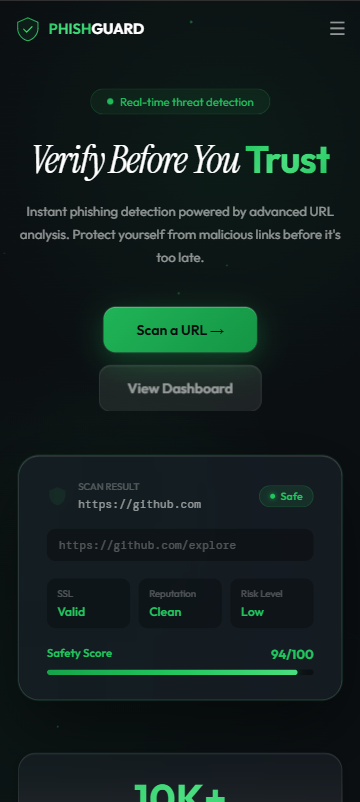

<div align="center">

# 🛡️ PhishGuard

**AI-powered phishing detection platform focused on helping users identify malicious, suspicious, and legitimate URLs through an intuitive and modern web interface.**

[](https://phishguard.qzz.io)
[](#)
[](#-source-code-notice)

🌐 **Live Demo:** [https://phishguard.qzz.io](https://phishguard.qzz.io)

</div>

---

## ⚠️ Source Code Notice

This repository serves as a **public showcase** for the PhishGuard project.

The complete source code, backend implementation, Firebase configuration, security rules, and proprietary detection logic are maintained in a **private repository**.

This repository is intended to demonstrate the project's capabilities, design, architecture, and development process without exposing the implementation.

---

## Overview

PhishGuard is a cybersecurity-focused web application designed to help users evaluate the safety of websites before visiting them.

The project aims to provide a simple yet informative interface where users can submit a URL and receive an easy-to-understand security assessment.

Rather than overwhelming users with technical jargon, PhishGuard translates multiple security indicators into a clean visual report that anyone can understand.

---

## Key Features

- URL safety analysis
- Safe / Suspicious / Malicious classification
- Modern cybersecurity dashboard
- Risk score visualization
- Security status indicators
- Scan history (authenticated users)
- Firebase Authentication
- Google Sign-In support
- Responsive UI
- Dark theme interface
- Mobile-first design
- Fast loading experience
- Real-time security reports
- User profile management
- Secure cloud database integration

---

## Technology Stack

### Frontend
| Technology | Details |
|------------|---------|
| HTML5 | Semantic markup |
| CSS3 | Modern styling & animations |
| JavaScript (ES6+) | Application logic |

### Backend & Cloud
| Technology | Details |
|------------|---------|
| Firebase Authentication | User sign-in & session management |
| Firebase Firestore | Cloud scan history & user data |
| Firebase Hosting | Static site deployment |

### UI/UX
| Principle | Implementation |
|-----------|---------------|
| Responsive Design | Mobile-first layout |
| Modern Glassmorphism | Glass card aesthetic |
| Dark Theme | Cybersecurity-focused palette |
| Smooth Animations | Transitions & motion |

---

## Screenshots

### Home Page


### URL Scanner


### Scan Result


### Dashboard


### Login


### Mobile View


---

## Project Architecture

```
User
 │
 ▼
Modern Web Interface
 │
 ▼
URL Scan Request Engine
 │
 ┌──────────────┴──────────────┐
 ▼                             ▼
Authentication            URL Analysis
 │                             │
 ▼                             ▼
Firebase Auth         Security Evaluation
 │                             │
 └──────────────┬──────────────┘
                ▼
        Firestore Database
                │
                ▼
        Security Dashboard
```

---

## Design Philosophy

PhishGuard was designed with three core principles:

**Simplicity** · **Transparency** · **User Safety**

Every security result is presented using intuitive colors, progress indicators, and clear explanations so that even non-technical users can understand the outcome.

### Security

The application follows best practices by:

- Using secure authentication
- Protecting user data
- Keeping sensitive backend logic private
- Preventing exposure of API credentials
- Separating frontend from protected services

---

## Roadmap

Future versions may include:

- [ ] AI-powered phishing prediction
- [ ] Browser Extension
- [ ] Email phishing scanner
- [ ] QR code safety checker
- [ ] Password leak detection
- [ ] Malware reputation lookup
- [ ] Domain age analysis
- [ ] WHOIS information
- [ ] SSL certificate inspection
- [ ] Community reporting
- [ ] Browser history protection
- [ ] Threat intelligence integration

---

## Development Status

| | |
|---|---|
| ✅ | Live Demo Available |
| 🚧 | Actively Improving |

Future updates will continue to enhance performance, detection accuracy, accessibility, and user experience.

---

## Live Demo

Visit the live project: [https://phishguard.qzz.io](https://phishguard.qzz.io)

---

## Repository Contents

This repository intentionally includes only:

- Documentation
- Project overview
- Architecture
- Screenshots
- Feature list
- Demonstration resources

The implementation repository remains private.

---

## Disclaimer

PhishGuard is developed for educational, research, and cybersecurity awareness purposes.

Security reports generated by the application should be considered informational and should not replace comprehensive security assessments.

---

## Author

Developed by **Rishipratim Karmakar**

If you're interested in discussing the project, collaboration opportunities, or providing feedback, feel free to reach out.

---

<div align="center">

⭐ If you enjoyed exploring PhishGuard, consider starring this showcase repository.

</div>
